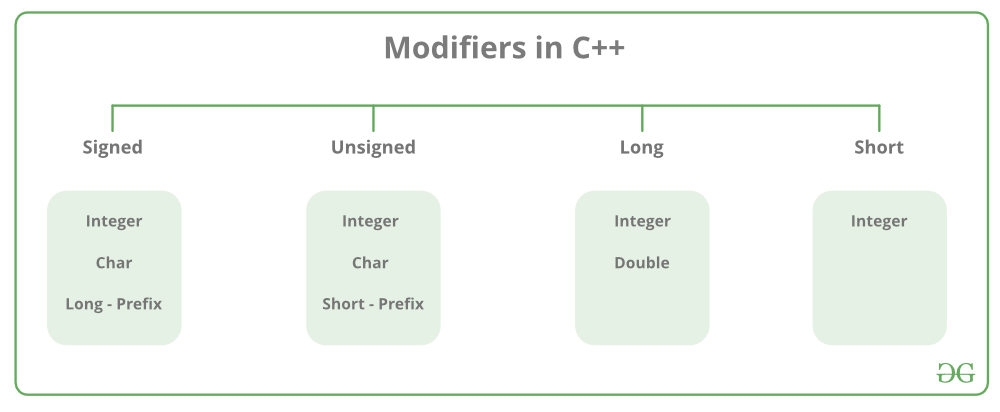

# Переменные. Способы объявления. Правила именования

Переменная - область оперативной памяти, обладающая собственным именем и предназначенная для хранения данных разных типов, данные могут быть изменены.

- https://en.cppreference.com/w/cpp/language/types
- https://www.geeksforgeeks.org/c-data-types/

> Размер переменных может быть разным в зависимости от компилятора и компьютера
> который используется

## Примитивы

Эти типы данных являются встроенными и могут быть использованы напрямую для объявления переменных пользователем.

- `short`
- `int`
- `char`
- `bool`
- `float`
- `double`
- `void`
- `wchar_t`

## Производные типы

- Функции
- Массивы
- Указатели
- Ссылки

## Абстрактные или пользовательские типы

- Классы
- Структуры
- Юнионы
- Enum'ы
- `Typedef defined Datatype`

## Модификаторы типов данных

|        Data Type       | Size (in bytes) |              Range              |
|:----------------------:|:---------------:|:-------------------------------:|
|        short int       |        2        |        -32,768 to 32,767        |
|   unsigned short int   |        2        |           0 to 65,535           |
|      unsigned int      |        4        |        0 to 4,294,967,295       |
|           int          |        4        | -2,147,483,648 to 2,147,483,647 |
|        long int        |        4        | -2,147,483,648 to 2,147,483,647 |
|    unsigned long int   |        4        |        0 to 4,294,967,295       |
|      long long int     |        8        |       -(2^63) to (2^63)-1       |
| unsigned long long int |        8        | 0 to 18,446,744,073,709,551,615 |
|       signed char      |        1        |           -128 to 127           |
|      unsigned char     |        1        |             0 to 255            |
|          float         |        4        |                                 |
|         double         |        8        |                                 |
|       long double      |        12       |                                 |
|         wchar_t        |      2 or 4     |         1 wide character        |

